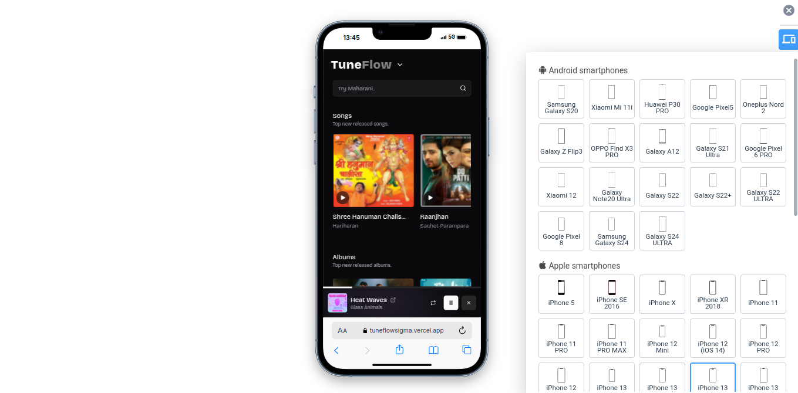
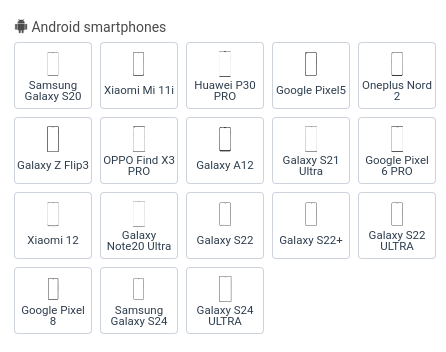
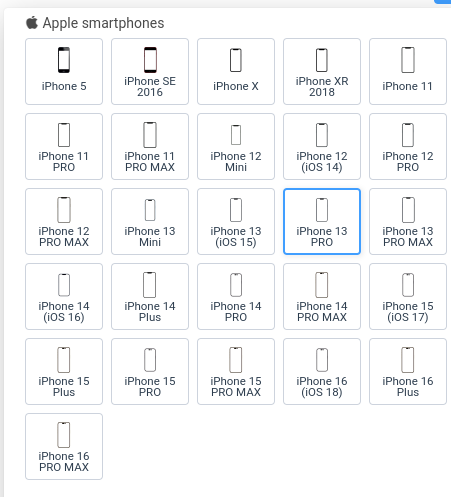
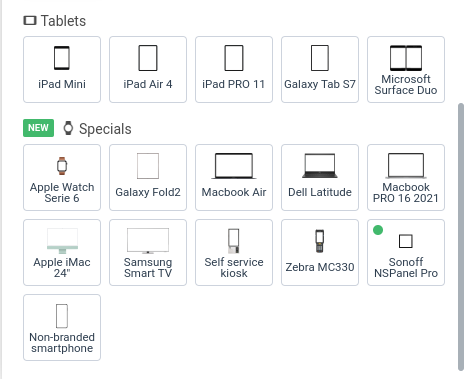
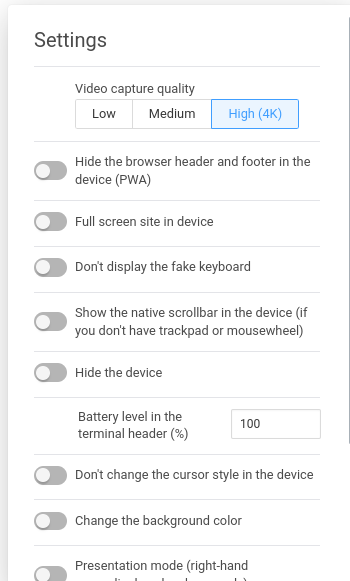
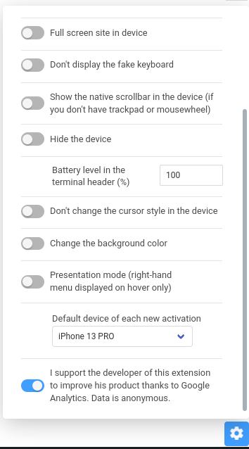

# 📱 Mobile Simulator – Fully Unlocked Version (Mod)

  
  
  
  

---

This is a **modded version** of the Chrome extension [Mobile Simulator - Responsive Testing Tool](https://chromewebstore.google.com/detail/mobile-simulator-responsi/ckejmhbmlajgoklhgbapkiccekfoccmk?hl=en-GB) by **webmobilefirst.com**.  
In this mod, all **premium (PRO) features** are **unlocked for free**, offering full functionality without any payment! 🚀

---

## ✨ Features Unlocked

- ✅ **Presenter Mode** available
- ✅ Manual **Battery Level** settings
- ✅ Custom **Background Color** (Hex, RGB, etc.)
- ✅ Toggle **Scrollbars**, **Keyboards**, **Headers**, and **Footers**
- ✅ Device **Cursor** settings
- ✅ Choose your **Default Device**
- ✅ **High Video Quality** (up to 4K)
- ✅ **No more PRO popups**
- ✅ Fully Offline

---

## 🚀 How to Install

1. Download this repo as zip and then extract it (We need folder) or clone this repository.
2. Open Chrome/Edge/Brave and go to `chrome://extensions/`.
3. Enable **Developer Mode**.
4. Click **Load Unpacked** and select this project folder.
5. Enjoy!

---

## 📸 Screenshots

## 📜 Credits

- Original Project: [Mobile Simulator - Responsive Testing Tool](https://chromewebstore.google.com/detail/mobile-simulator-responsi/ckejmhbmlajgoklhgbapkiccekfoccmk?hl=en-GB)
- Modded By: **[@satyam-is-pro](https://github.com/satyam-is-pro)**

---

## ⚡ Disclaimer

> This mod is for **personal, educational, and non-commercial purposes** only.  
> Please support the original developers if you like the extension!

---

## 🌟 Like the Project?

- ⭐ Star this repo
- 📤 Share it
- 💬 Suggest improvements
